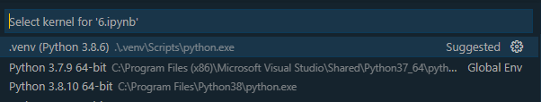

# minikurs
Minikurs for utviklere. Kickoff 2022

# Run from colab

# Run locally

## Prerequisite
- python, ~3.8
- git bash, latest

## Setup
- Open terminal in desired location
- Run `git clone https://github.com/Fundator/minikurs.git`
- Run `cd minikurs`
- Run `./setup.sh` or `.\setup.ps1` depending on type of terminal

## Option 1: Run a jupyter server in terminal:

In a terminal from this repository type `jupyter notebook`
A browser window with jupyter should pop up.

## Option 2: Run notebook server in vscode:

Open a notebook, press `ctrl+shift+p`, and type `select notebook kernel`, and choose the virtual environment.

